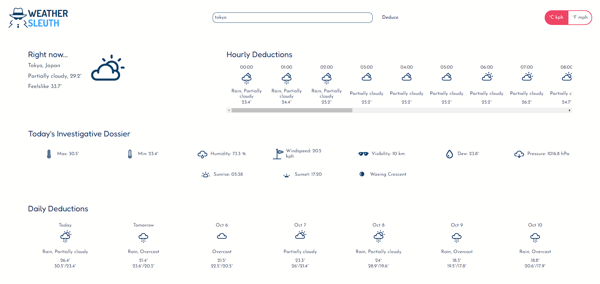
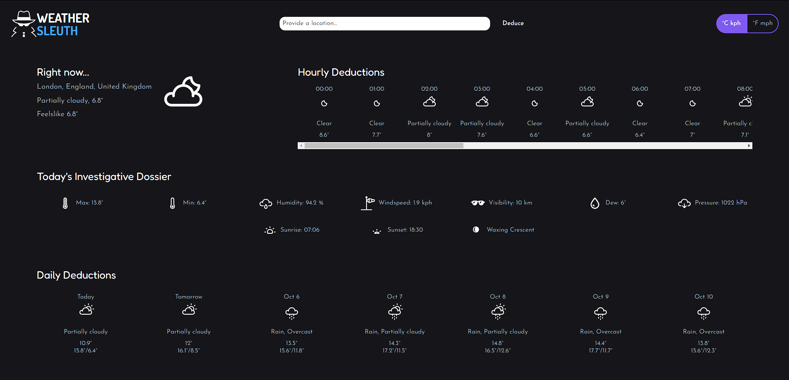

# Weather App

This is Weather Sleuth, a weather app developed into the browser to fetch weather conditions over any place in the world. This is implemented using HTML, CSS, JavaScript, Webpack, through **Visual Crossing API**.

Check it out :point_right:[here!](https://mell62.github.io/weather-app/):point_left:

## :joystick: Features

- Search for the weather conditions over any location around the world
- Multiple weather attributes such as humidity, windspeed, visibility, dew, pressure, sunrise, sunset, moonphase
- Hourly and weekly weather conditions
- Icons change corresponding to the associated weather condition
- Fallback imaginary weather conditions will be displayed upon any API errors

## :tada: Achievements

- **Visual Crossing API** is utilized for fetching weather data around the world
- **Webpack** is utilized for the bundling of code of multiple files through ES6 Modules and minification
- **Single responsibility principle** applied to develop many functions and modules

## :magic_wand: Extras!

- A loading message displays when weather is being fetched
- Day and night mode: Webpage switches to light mode and dark mode depending on whether it is day time or night time at the location searched for

## :page_with_curl: Note

- Modern normalize is used for cross-browser consistency
- Babel is used to transpile code for older browsers
